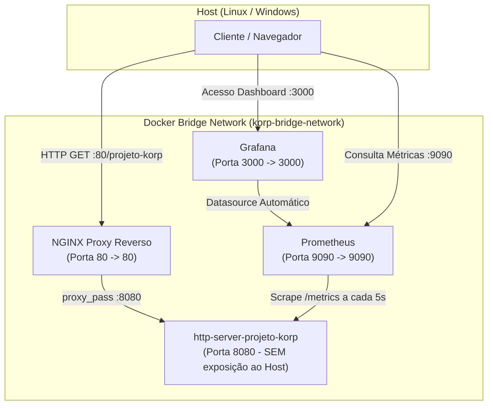

# Desafio Técnico DevOps - Projeto Korp

[](https://golang.org/)
[](https://www.docker.com/)
[](https://nginx.org/)
[](https://prometheus.io/)
[](https://grafana.com/)
[](https://www.ansible.com/)

Este repositório contém a solução completa para o **Desafio Técnico DevOps da Korp**, implementando um microserviço HTTP em **Golang**, arquitetura de containers com isolamento de rede via **Docker Compose**, proxy reverso **NGINX**, observabilidade de ponta a ponta com **Prometheus e Grafana** (100% provisionados como código), e automação de provisionamento em um único comando com **Ansible**.

---

## 🏛️ Arquitetura da Solução



---

## 📋 Atendimento aos Requisitos do Desafio

| Requisito do Edital | Implementação | Arquivo / Referência |
| :--- | :--- | :--- |
| **Microserviço Golang** | Servidor HTTP na porta 8080 com endpoint `GET /projeto-korp` | [`app/main.go`](app/main.go) |
| **Horário UTC Dinâmico** | Retorno JSON com `horario` atualizado dinamicamente em tempo real (RFC3339) | [`app/main.go`](app/main.go) |
| **Dockerfile Multi-Stage** | Build otimizado (`golang:1.22-alpine` -> `alpine:3.20`), non-root user e healthcheck | [`app/Dockerfile`](app/Dockerfile) |
| **Testes Unitários** | Cobertura de testes dos endpoints, métodos permitidos e métricas | [`app/main_test.go`](app/main_test.go) |
| **Rede Docker Bridge** | Rede customizada `korp-bridge-network` para comunicação isolada entre containers | [`docker-compose.yml`](docker-compose.yml) |
| **Isolamento de Porta** | Aplicação Go exposta apenas internamente (`expose: 8080`), sem binding no Host | [`docker-compose.yml`](docker-compose.yml) |
| **Proxy Reverso NGINX** | NGINX escutando na porta 80 e encaminhando para `http-server-projeto-korp:8080` | [`nginx/conf.d/http-server-projeto-korp.conf`](nginx/conf.d/http-server-projeto-korp.conf) |
| **Métricas Obrigatórias** | `service_availability` (disponibilidade) e `http_requests_total` (volume de requisições) | [`app/main.go`](app/main.go) |
| **Prometheus** | Coleta periódica a cada 5 segundos das métricas do microserviço | [`monitoring/prometheus/prometheus.yml`](monitoring/prometheus/prometheus.yml) |
| **Grafana Automatizado (Bônus)** | Datasource e Dashboard importados como código via *Provisioning* | [`monitoring/grafana/provisioning/`](monitoring/grafana/provisioning/) |
| **Automação Ansible** | Provisionamento completo e teste de fumaça em **um único comando** | [`ansible/playbook.yml`](ansible/playbook.yml) |

---

## 🚀 Como Executar o Projeto

### Opção 1: Provisionamento com 1 Único Comando via Ansible (Requisito Principal)

Para provisionar todo o ambiente automaticamente em ambiente Linux (ou WSL2):

```bash
cd ansible
ansible-playbook -i inventory.ini playbook.yml
```

O Ansible executará:
1. Validação/Instalação do Docker e Compose Plugin.
2. Criação da rede Docker bridge.
3. Build da imagem da aplicação Go com testes unitários automáticos.
4. Execução coordenada dos 4 containers via Docker Compose.
5. Validação HTTP do endpoint via NGINX e exibição do JSON no console.

---

### Opção 2: Execução Direta via Docker Compose

Caso prefira subir diretamente via Docker:

```bash
# Subir toda a stack e compilar imagens
docker compose up -d --build

# Verificar containers em execução
docker compose ps
```

---

## 🔍 Testes e Endpoints Disponíveis

### 1. Serviço HTTP (via Proxy NGINX - Porta 80)
```bash
curl http://localhost:80/projeto-korp
```
**Resposta esperada:**
```json
{
  "nome": "Projeto Korp",
  "horario": "2026-09-07T14:50:42Z"
}
```

### 2. Validação de Segurança (Isolamento da porta 8080)
```bash
# A chamada direta à porta 8080 no host deve falhar (rejeitada/timeout)
curl http://localhost:8080/projeto-korp
```

### 3. Métricas do Prometheus
- **URL**: [http://localhost:9090](http://localhost:9090)
- **Status dos Alvos**: [http://localhost:9090/targets](http://localhost:9090/targets) *(Target `http-server-projeto-korp` estará UP)*.

### 4. Dashboard no Grafana (Provisionado Automaticamente)
- **URL**: [http://localhost:3000](http://localhost:3000)
- **Credenciais padrão**: Usuário `admin` / Senha `admin` (ou acesso anônimo habilitado).
- **Dashboard**: Acesse em **Dashboards** > pasta **Korp** > **HTTP Server Projeto Korp - Dashboard**.
- **Painéis inclusos**:
  - Disponibilidade do serviço (Gauge UP / DOWN).
  - Volume total consolidado de requisições.
  - Distribuição de requisições por Status Code HTTP (200, 405, etc.).
  - Gráfico temporal de Throughput (Requisições por segundo - RPS).
  - Tempo médio de resposta / latência.

---

## 📂 Estrutura de Diretórios

```text
.
├── app/
│   ├── Dockerfile                               # Multi-stage build (golang:alpine -> alpine)
│   ├── go.mod                                   # Módulo Go e dependências
│   ├── main.go                                  # Código-fonte da aplicação e métricas Prometheus
│   └── main_test.go                             # Testes unitários automatizados
├── nginx/
│   └── conf.d/
│       └── http-server-projeto-korp.conf        # Configuração de proxy reverso NGINX
├── monitoring/
│   ├── prometheus/
│   │   └── prometheus.yml                       # Configuração de scrape do Prometheus
│   └── grafana/
│       └── provisioning/
│           ├── datasources/
│           │   └── datasources.yml              # Datasource Prometheus automático
│           └── dashboards/
│               ├── dashboards.yml               # Provider automático de dashboards
│               └── http-server-projeto-korp-dashboard.json # JSON do dashboard
├── ansible/
│   ├── ansible.cfg                              # Parâmetros de execução do Ansible
│   ├── inventory.ini                            # Inventário (localhost / hosts remotos)
│   └── playbook.yml                             # Playbook de provisionamento de 1 comando
├── docker-compose.yml                           # Orquestração dos 4 containers e rede bridge
├── .gitignore
└── README.md
```

---

## 🔄 Esteira CI/CD (Azure DevOps Pipelines)

Como diferencial técnico e bônus arquitetural, o projeto conta com uma esteira de **CI/CD no Azure Pipelines** ([`azure-pipelines.yml`](azure-pipelines.yml)) integrada ao repositório:

1. **Stage 1 (CI - Cloud)**: Executado em agentes Microsoft Hosted (`ubuntu-latest`):
   - Execução dos testes unitários em Go (`go test -v ./...`).
   - Validação estática e checagem de sintaxe do playbook Ansible (`ansible-playbook --syntax-check`).
2. **Stage 2 (CD - Local Notebook)**: Executado via **Self-Hosted Agent** diretamente no notebook do desenvolvedor:
   - Orquestra a execução do Playbook Ansible (`ansible-playbook -i inventory.ini playbook.yml`).
   - Provisiona todos os containers e valida a resposta HTTP na porta 80 localmente.

📖 *Para instruções detalhadas de configuração do agente e pipeline, consulte o guia:* [`docs/azure-devops-guide.md`](docs/azure-devops-guide.md).

---

## 💡 Decisões Técnicas e Boas Práticas

1. **Multi-Stage Build**: A imagem final da aplicação Go utiliza `alpine:3.20`, gerando uma imagem de aproximadamente 15MB, sem ferramentas desnecessárias em tempo de execução, reduzindo drasticamente a superfície de ataque (*attack surface*).
2. **Segurança de Containers**: A aplicação roda com usuário não-privilegiado (`appuser:appgroup`), evitando execução como `root`.
3. **Isolamento de Rede**: O serviço Go não publica portas no host (`expose` ao invés de `ports`), garantindo que todo o tráfego externo passe obrigatoriamente pelo NGINX.
4. **Graceful Shutdown**: Implementado em Go com interceptação de `SIGINT` e `SIGTERM`, garantindo que requisições em andamento sejam concluídas antes do desligamento.
5. **Infraestrutura como Código (IaC)**: Tanto o Ansible quanto o provisionamento do Grafana e Prometheus são declarativos, garantindo idempotência e reprodutibilidade em qualquer ambiente.
