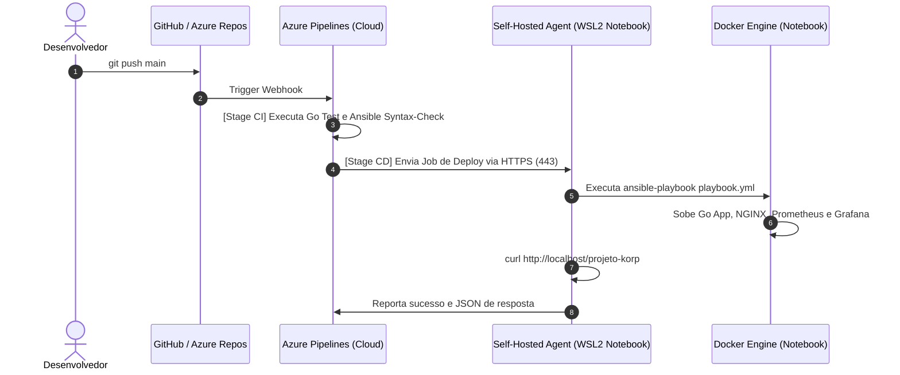

# Guia de Configuração: Azure DevOps CI/CD com Self-Hosted Agent

Este guia descreve como configurar o **Azure Pipelines** para orquestrar o provisionamento automatizado do projeto diretamente no seu notebook utilizando um **Self-Hosted Agent** rodando no WSL2 (Ubuntu).

---

## 🏗️ Arquitetura da Esteira



---

## 📋 Passo a Passo de Configuração

### 1. Criar a Agent Pool no Azure DevOps
1. Acesse sua organização no Azure DevOps: `https://dev.azure.com/<sua-organizacao>/<seu-projeto>`.
2. No canto inferior esquerdo, clique em **Project Settings**.
3. Em **Pipelines**, selecione **Agent pools**.
4. Clique em **Add pool**:
   - **Pool type**: New
   - **Pool to link**: (marcado)
   - **Name**: `Local-Notebook` (ou use a pool `Default` e ajuste a variável no `azure-pipelines.yml`).
   - Marque a opção: *Grant access permission to all pipelines*.
5. Clique em **Create**.

---

### 2. Gerar o Personal Access Token (PAT)
1. No canto superior direito do Azure DevOps, clique no ícone de **User Settings** (ao lado da sua foto) > **Personal Access Tokens**.
2. Clique em **+ New Token**.
3. Defina:
   - **Name**: `notebook-agent-token`
   - **Expiration**: 30 ou 90 dias
   - **Scopes**: Selecione **Custom defined** > Em **Agent Pools**, marque **Read & manage**.
4. Clique em **Create** e **copie o token gerado**.

---

### 3. Instalar e Iniciar o Agente no WSL2 (Notebook)
Abra o seu terminal **WSL2 (Ubuntu)** e execute:

```bash
# 1. Criar diretório para o agente
cd ~
mkdir -p myagent && cd myagent

# 2. Baixar o agente oficial do Azure DevOps para Linux x64
wget https://vstsagentpackage.azureedge.net/agent/3.248.0/vsts-agent-linux-x64-3.248.0.tar.gz

# 3. Descompactar
tar zxvf vsts-agent-linux-x64-3.248.0.tar.gz

# 4. Configurar o agente (insira sua URL e PAT quando solicitado)
./config.sh --unattended \
  --url https://dev.azure.com/<sua-organizacao> \
  --auth pat \
  --token <SEU_PERSONAL_ACCESS_TOKEN> \
  --pool Local-Notebook \
  --agent notebook-rcomoti \
  --work _work \
  --acceptTeeEula

# 5. Iniciar o agente
./run.sh
```

> **Dica**: O agente ficará em modo de escuta (*Listening for Jobs*). Como a conexão é feita via HTTPS de saída (porta 443), você **não precisa abrir portas no seu roteador**.

---

### 4. Criar a Pipeline no Azure DevOps
1. No menu lateral do Azure DevOps, vá em **Pipelines** > **Pipelines**.
2. Clique em **Create Pipeline** (ou *New Pipeline*).
3. Selecione a origem do código:
   - Se estiver usando o **GitHub**: Escolha **GitHub** e autorize o repositório `RComoti/testekorp`.
   - Se estiver usando o **Azure Repos**: Escolha **Azure Repos Git** e selecione o repositório.
4. Escolha **Existing Azure Pipelines YAML file**.
5. No caminho do arquivo, selecione `/azure-pipelines.yml` e branch `main`.
6. Clique em **Run**.

---

## 🎯 Resultado Esperado

1. O estágio **CI** rodará em agentes Microsoft na nuvem e executará os testes unitários em Go e checagem de sintaxe do Ansible.
2. O estágio **CD** será enviado automaticamente para o seu notebook (onde o `./run.sh` está rodando).
3. O Ansible subirá toda a stack Docker localmente e validará a resposta do endpoint com sucesso!
