# Arquitetura CI/CD no Azure DevOps - Desafio DevOps Korp

Este documento descreve a arquitetura desacoplada de **CI/CD** implementada no **Azure DevOps**, separando as responsabilidades de **Build (Integração Contínua)** e **Release (Entrega Contínua / Deploy)** conforme as melhores práticas do mercado e modelo GitFlow.

---

## 🏛️ Visão Geral da Arquitetura

```mermaid
flowchart LR
    subgraph GitFlow ["Controle de Versão (GitFlow)"]
        DevBranch["Branch: dev"]
        HomologBranch["Branch: homolog"]
        MainBranch["Branch: main (prod)"]
    end

    subgraph CI ["Azure Pipelines (CI / Build)"]
        BuildPipeline["Pipeline: TesteKorp-CI-CD<br/>(Pool: Azure Pipelines - ubuntu-latest)"]
        GoTest["1. Testes Unitários Go"]
        AnsibleLint["2. Checagem Sintaxe Ansible"]
        ArtifactDrop["3. Publicação do Artefato 'drop'"]
    end

    subgraph CD ["Azure Releases (CD / Deploy)"]
        ReleaseDef["Release: TesteKorp-CD-Release"]
        StageDev["Stage: DEV<br/>(Vars: vg-testekorp-dev)"]
        StageHomolog["Stage: HOMOLOG<br/>(Vars: vg-testekorp-homolog)"]
        StageProd["Stage: PROD<br/>(Vars: vg-testekorp-prod)"]
    end

    DevBranch -- "Push" --> BuildPipeline
    HomologBranch -- "Push" --> BuildPipeline
    MainBranch -- "Push" --> BuildPipeline

    BuildPipeline --> GoTest --> AnsibleLint --> ArtifactDrop
    ArtifactDrop -- "Trigger CD Automático" --> ReleaseDef

    ReleaseDef --> StageDev
    StageDev -- "Aprovação / Trigger" --> StageHomolog
    StageHomolog -- "Aprovação / Trigger" --> StageProd
```



---

## 1. Pipeline de Integração Contínua (CI)

- **Localização**: Menu lateral **Pipelines** > **Pipelines** > **`TesteKorp-CI-CD`**.
- **Definição declarativa**: [`azure-pipelines.yml`](../azure-pipelines.yml).
- **Gatilhos (Triggers)**: Disparo automático a cada novo commit nas branches:
  - `dev`
  - `homolog`
  - `main`
- **Agente de Execução**: Pool gerenciada da Microsoft (`Azure Pipelines` com `vmImage: ubuntu-latest`).
- **Etapas do Job**:
  1. **GoTool@0**: Instala o Go 1.22.
  2. **Go Test**: Executa `go mod download` e roda os testes unitários da aplicação (`go test -v ./...`).
  3. **Ansible Lint**: Valida estaticamente a sintaxe do playbook (`ansible-playbook -i inventory.ini --syntax-check playbook.yml`).
  4. **PublishBuildArtifacts@1**: Empacota o código, scripts Ansible, arquivos do Nginx, Prometheus e Compose no artefato versionado **`drop`**.

---

## 2. Definição de Entrega Contínua (CD / Releases)

- **Localização**: Menu lateral **Pipelines** > **Releases** > **`TesteKorp-CD-Release`**.
- **Artefato Vinculado**: `_TesteKorp-CI-CD` (artefato `drop` gerado pelo pipeline de CI).
- **Gatilho de CD**: *Continuous Deployment trigger* ativado para criar releases automaticamente a cada novo build com sucesso.

### Estágios / Ambientes Configurados:

| Ambiente | Estágio na Release | Variable Group Vinculado | Agente de Execução | Descrição |
| :--- | :--- | :--- | :--- | :--- |
| **DEV** | `DEV` | `vg-testekorp-dev` | Self-Hosted (`$seu-notebook`) | Deploy e testes no ambiente de desenvolvimento |
| **HOMOLOG** | `HOMOLOG` | `vg-testekorp-homolog` | Self-Hosted (`$seu-notebook`) | Deploy e validações pré-produção |
| **PROD** | `PROD` | `vg-testekorp-prod` | Self-Hosted (`$seu-notebook`) | Deploy final em produção |

- **Agent Pool Utilizado**: `TesteKorp-AgentPool`
- **Nome do Agente**: `$seu-notebook` (Self-Hosted Runner local em Linux/WSL2 executando Docker e Ansible diretamente no host)

---

## 3. Definição de Desprovisionamento e Destruição (CD / Teardown)

- **Localização**: Menu lateral **Pipelines** > **Releases** > **`TesteKorp-CD-Release-Destroy`**.
- **Objetivo**: Gestão do ciclo de vida da infraestrutura (desprovisionamento e limpeza completa sob demanda).
- **Gatilho de Execução**: **100% Manual (On-Demand)** — sem gatilhos automáticos para proteção e segurança contra exclusões acidentais.
- **Estágios Disponíveis**: `DEV`, `HOMOLOG` e `PROD`.
- **Ação Executada no Agente (`$seu-notebook`)**:
  ```bash
  cd $(System.DefaultWorkingDirectory)/_TesteKorp-CI-CD/drop
  docker compose down -v --rmi all
  docker network rm korp-bridge-network || true
  ```
- **Resultado**: Remove todos os containers, volumes, redes e imagens de forma segura e idempotente em um único clique.

---

## 4. Gerenciamento de Segredos e Variáveis (Library)

Seguindo as melhores práticas de DevSecOps, nenhuma credencial sensível fica no código-fonte. Todas estão centralizadas em **Pipelines** > **Library**:

- **`vg-testekorp-dev`**:
  - `ENVIRONMENT`: `dev`
  - `SERVICE_PORT`: `8081`
  - `GRAFANA_ADMIN_USER`: `admin`
  - `GRAFANA_ADMIN_PASSWORD`: *(Secret)*
  - `APP_SECRET_KEY`: *(Secret)*
- **`vg-testekorp-homolog`**:
  - `ENVIRONMENT`: `homolog`
  - `SERVICE_PORT`: `8082`
  - `GRAFANA_ADMIN_USER`: `admin`
  - `GRAFANA_ADMIN_PASSWORD`: *(Secret)*
  - `APP_SECRET_KEY`: *(Secret)*
- **`vg-testekorp-prod`**:
  - `ENVIRONMENT`: `prod`
  - `SERVICE_PORT`: `80`
  - `GRAFANA_ADMIN_USER`: `admin`
  - `GRAFANA_ADMIN_PASSWORD`: *(Secret)*
  - `APP_SECRET_KEY`: *(Secret)*

---

## 5. Como Validar no Portal do Azure DevOps

1. Acesse o projeto: `https://dev.azure.com/<sua-organizacao>/TesteKorp`
2. **Pipelines de CI**: Vá em **Pipelines** > **Pipelines** para ver as execuções bem-sucedidas em `dev`, `homolog` e `main`.
3. **Releases de CD**: Vá em **Pipelines** > **Releases** para visualizar o pipeline de release com os estágios `DEV`, `HOMOLOG` e `PROD`.
4. **Library**: Vá em **Pipelines** > **Library** para verificar os Variable Groups protegidos.
5. **Agent Pools**: Vá em **Project Settings** > **Agent pools** > **TesteKorp-AgentPool** para verificar o agente `$seu-notebook` online.
